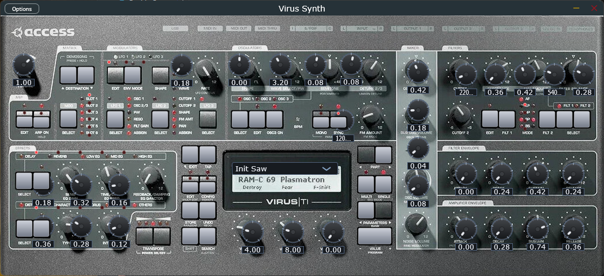
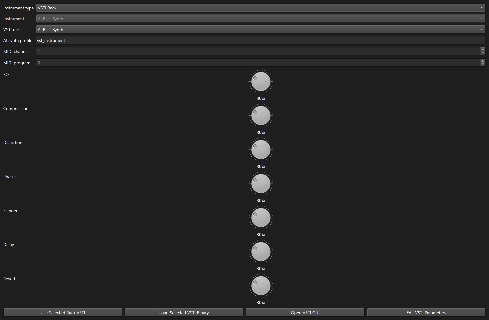
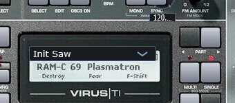
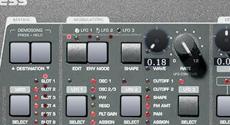
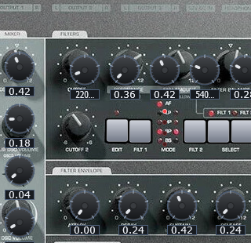

# AI Music Studio (MIDI + AI Instrument Rendering + Samples)

A desktop MIDI editor DAW prototype with a GUI built in **PySide6**, with:
- OpenAI-assisted composition,
- MIDI import split by channel/program with AI instrument assignment, and
- sample workflow with **WAV/MP3 import/export** plus waveform timeline display.

Live page: [mysticalg.github.io/AI-Music-Studio](https://mysticalg.github.io/AI-Music-Studio/)
Releases: [github.com/mysticalg/AI-Music-Studio/releases](https://github.com/mysticalg/AI-Music-Studio/releases)

## Implemented features

- Track timeline panel for MIDI tracks
- Piano roll editor with right-click mini toolbar (selector, pencil, scissors, eraser, line tool)
- Note length selector in-editor for drawing tools
- Quantization (1/4, 1/8, 1/16, 1/32)
- MIDI import/export (`.mid`) via `mido`
- MIDI import by channel/program into separate tracks
- AI instrument assignment per MIDI track (horn/strings/bass/etc.)
- AI-style MIDI synthesis rendering to WAV stems per track (`renders/*.wav`)
- **Sample toolbox** for WAV/MP3 sample import
- **Sample timeline tab** that displays waveform blocks when samples are placed
- **Sample timeline audio export** to WAV or MP3
- Mixer board (volume + pan + mute/solo per track)
- Instrument board (instrument type + GM/VSTI rack selection + FX metadata)
- Built-in FX rack controls for EQ, Compression, Distortion, Phaser, Flanger, Delay, Reverb
- Virtual piano keyboard input (computer keyboard)
- Floating transport bar with playback controls, tempo setting, and loop locators
- Keyboard shortcuts for transport/editing
- OpenAI Codex composition from natural language prompts

## OpenAI integration setup

Set your API key before launching:

```bash
export OPENAI_API_KEY="your_api_key_here"
# optional (defaults to gpt-5-codex)
export OPENAI_MODEL="gpt-5-codex"
```

OpenAI is used for:
- AI composition (`Ctrl+G`),
- Codex track assistant actions from **Settings > OpenAI > Prompt Codex About Tracks**, and
- optional instrument-family classification during MIDI import.

You can connect OpenAI in-app via **Settings > OpenAI > Connect** using either:
- API key mode, or
- OAuth / Access Token mode by pasting an OpenAI access token directly (recommended), with optional advanced PKCE authorization-code exchange.

If OpenAI is not connected, classification falls back to deterministic GM/track-name heuristics.

## Audio format notes (WAV/MP3)

- WAV import/export is native.
- MP3 import/export requires `ffmpeg` available on your system PATH.
- Imported MP3 files are converted to WAV internally for waveform preview/rendering.

## Quick start

```bash
python -m venv .venv
source .venv/bin/activate
pip install -r requirements.txt
python app.py
```

## Windows release packaging

Local portable build:

```powershell
powershell -ExecutionPolicy Bypass -File .\scripts\build_windows_release.ps1 -ReleaseVersion v0.1.0
```

That script:
- installs build-time dependencies into `.venv-release`
- packages the app with PyInstaller
- copies bundled `vsti/` content when present
- writes a portable ZIP into `dist/`

Automated GitHub release:

```bash
git tag v0.1.0
git push origin main --tags
```

Pushing a `v*` tag triggers `.github/workflows/release.yml`, which builds the Windows release ZIP and publishes it to GitHub Releases.

## GitHub Pages

The project site is served from the `docs/` folder via `.github/workflows/deploy-pages.yml`. Any push to `main` that changes `docs/`, `README.md`, or the Pages workflow republishes the site.

## Virus Synth

The bundled flagship instrument is now **Virus Synth**, a Virus TI-inspired editor and synth engine with:

- fixed-pixel Access-style panel layout
- themed hardware-style knobs, LEDs, and buttons
- preset browsing through the LCD / OSD area
- focused oscillator editing with shared top-row controls
- filter, FX, arpeggiator, matrix, and LFO OSD pages
- preview keyboard and background-image toggle inside the editor



### Virus Synth quick start

1. Open **Panels > Instruments and FX** and set the track instrument type to **VSTI Rack**.
2. Choose **Virus Synth** from the rack instrument list.
3. Open the editor window and use the **PART** buttons or **VALUE PROGRAM - / +** buttons to browse presets.
4. Use **OSC SELECT** to choose which oscillator the shared top-row controls edit.
5. Press **FILTER EDIT** or **FX EDIT** to open a pinned LCD page, then use **VALUE 1 / 2 / 3** to change the page parameters.
6. Use **LFO SELECT** to focus an LFO, then adjust **amount**, **rate**, and **destination** from the LCD page with the value knobs.
7. Toggle **BG** to switch between the faceplate view and the schematic view, and toggle **KB** to show the preview keyboard.

### Virus Synth step-by-step guide

1. Load the synth from the rack:
   use the track rack panel to assign **Virus Synth** to a track, then open the editor.

   

2. Browse presets from the LCD:
   the center display acts like the Virus OSD. Use the side **PART** buttons or the lower-right **VALUE PROGRAM** buttons to step through patches.

   

3. Edit the active oscillator:
   the top oscillator row is shared. Press **SELECT** to focus `OSC 1`, `OSC 2`, or `OSC 3`, then change wave, shape / pulse width, semitone, detune, and FM amount.

   

4. Use the modulation pages:
   press an `LFO SELECT` button once to focus that LFO. The LCD then exposes its amount, rate, and destination on **VALUE 1 / 2 / 3**. Repeated presses cycle the visible destination LEDs.

5. Use filter and FX edit pages:
   press **FILTER EDIT** to cycle the filter pages, or **FX EDIT** to open the focused upper or lower FX page. The LCD tells you what the three value knobs currently edit.

   

6. Use shifted functions:
   click **SHIFT** to latch the red secondary layer. The LED above **SHIFT** confirms that the shifted functions are active.

7. Shape the output:
   use the filter section for dual-filter editing, the upper FX row for delay / reverb / EQ pages, and the lower FX row for distortion / chorus / phaser / others.

Shifted functions currently include:
- `SHIFT + ARP ON` for arp hold
- `SHIFT + MONO` for panic / all notes off
- `SHIFT + STORE` for random preset
- `SHIFT + SEARCH` to audition the current preset

For the full web manual with screenshots, see the GitHub Pages guide:
[Virus Synth User Manual](https://mysticalg.github.io/AI-Music-Studio/virus-synth.html)

## macOS notes

- The app now stores preferences, renders, and user-imported helper assets in a per-user app data folder instead of the current working directory.
  - macOS: `~/Library/Application Support/AI Music Studio`
  - Windows: `%APPDATA%\\AI Music Studio`
  - Linux: `$XDG_DATA_HOME/ai-music-studio` or `~/.local/share/ai-music-studio`
- Bundled VST3 instruments are discovered from the app-local `vsti/` directory. On a packaged macOS `.app`, that maps to the app's `Contents/Resources/vsti` folder.
- Extra user-managed bundled VST3 files can also live in the per-user `vsti/` app data subfolder.
- The VST browser now prefers common platform plugin folders automatically, including:
  - macOS: `~/Library/Audio/Plug-Ins/VST3` and `/Library/Audio/Plug-Ins/VST3`
  - Windows: common Steinberg and `Common Files/VST3` locations

## macOS packaging outline

1. Build or download macOS-native `.vst3` bundles for the bundled instruments. Windows `.vst3` builds will not load on macOS.
2. Copy those bundles into `vsti/` before packaging, or into `AI Music Studio.app/Contents/Resources/vsti` after packaging.
3. Package the Python app as a macOS `.app` with Qt for Python deployment tooling such as `pyside6-deploy`.
4. Install runtime dependencies in the packaging environment, including `PySide6`, `numpy`, `mido`, and `python-rtmidi`.
5. Test audio output enumeration, VST3 discovery, and plugin UI opening on both Apple Silicon and Intel macOS if you plan to distribute widely.

## Usage flow (samples)

1. Click **Import Sample (WAV/MP3)** (or `Ctrl+Shift+O`)
2. Select a sample from **Samples Toolbox**
3. Click **Place Selected Sample On Timeline** and set start time
4. View waveform block in **Sample Timeline** tab
5. Export combined sample timeline audio via **Export Sample Timeline Audio (WAV/MP3)** (`Ctrl+E`)

## Keyboard shortcuts

- `Space` → Toggle Play/Stop
- `Ctrl+N` → New project
- `Ctrl+O` → Import MIDI + AI instrument assignment
- `Ctrl+Shift+O` → Import sample WAV/MP3
- `Ctrl+S` → Export MIDI
- `Ctrl+E` → Export sample timeline audio WAV/MP3
- `Ctrl+Q` → Quantize selected notes
- `Ctrl+R` → Render AI audio stems
- `Ctrl+G` → AI Compose
- `Delete` → Delete selected notes
- `Z/X/C/V/B/N/M/,` → Trigger virtual piano notes

## Experimental bundled VST3 instruments

A JUCE-based instrument scaffold is available in `plugins/AdvancedVSTi` with core synthesis modules (multi-wave oscillator, unison, FM, sync, filter modes, ADSR + curved envelopes, LFO routing, arp, rhythm gate). The shared source now builds these bundled VST3 instruments:

- `Virus Synth`
- `AI Drum Machine`
- `AI 808 Machine`
- `AI Bass Synth`
- `AI TB303`
- `AI String Synth`
- `AI Lead Synth`
- `AI Pad Synth`
- `AI Pluck Synth`
- `AI Sampler`
- `AI VEC1 Drum Pads`
- `AI Piano`
- `AI Strings`
- `AI Violin`
- `AI Flute`
- `AI Saxophone`
- `AI Bass Guitar`
- `AI Organ`

The acoustic suite keeps ADSR, filters, and onboard FX, but now leans on more instrument-specific playback: `AI Piano` uses a bundled multisample piano library, and `AI Strings`, `AI Violin`, `AI Flute`, `AI Saxophone`, `AI Bass Guitar`, and `AI Organ` can load open SFZ-based sample libraries from `.cache/OpenInstrumentSamples`.

Populate that cache with:

```bash
python scripts/fetch_open_instrument_samples.py
```

See `plugins/AdvancedVSTi/README.md` for build steps. The GitHub Actions workflow (`.github/workflows/build-vsti.yml`) packages the built `.vst3` bundles into a downloadable ZIP. If those bundles are copied into the app's local `vsti/` folder, AI Music Studio now auto-discovers and adds them to the VST rack on startup.

## Support

If you'd like to support this project, you can buy me a coffee:
[buymeacoffee.com/dhooksterm](https://buymeacoffee.com/dhooksterm)
